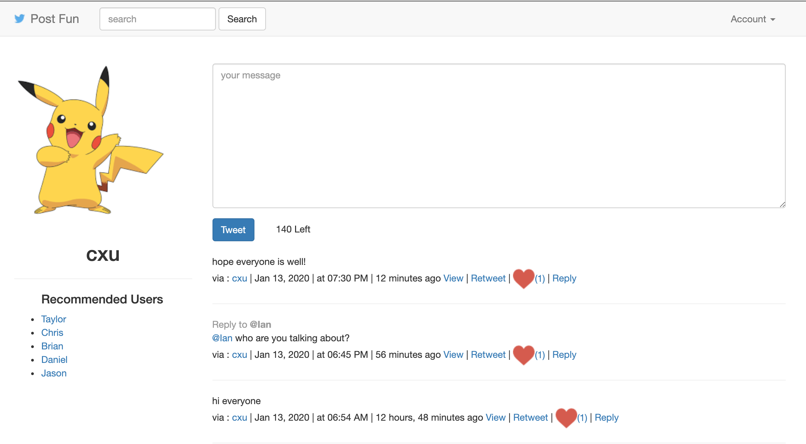

# Post Fun

Twitter-like web app built with Django with Bootstrap and Ajax

### Tech Stack
- Django
- DRF
- Twitter Bootstrap
- Ajax
- jQuery

### To Do
- Working on optimizing performance by adding Caching layer(**Redis**) and using **Solr** to provide search functionality
